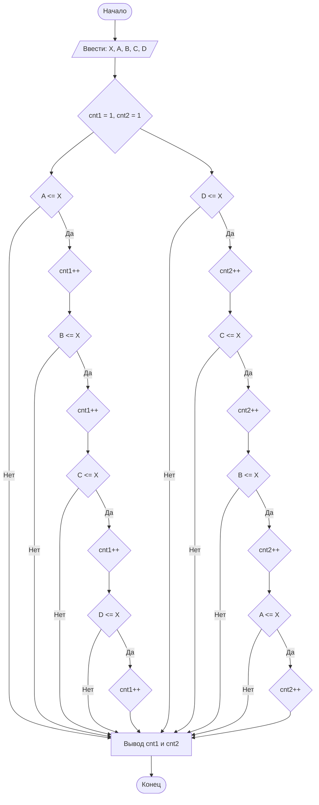

## Отчет по лабораторной работе № 1

#### № группы: `ПМ-2402`

#### Выполнил: `Тагирова Камилла Маратовна`

#### Вариант: `25`

### Cодержание:

- [Постановка задачи](#1-постановка-задачи)
- [Входные и выходные данные](#2-входные-и-выходные-данные)
- [Выбор структуры данных](#3-выбор-структуры-данных)
- [Алгоритм](#4-алгоритм)
- [Программа](#5-программа)
- [Анализ правильности решения](#6-анализ-правильности-решения)

### 1. Постановка задачи

> Программа получает на вход 5 натуральных чисел X, A, B, C и D, где X - это высота всех доминошек, а A, B, C и D - расстояние между соседними доминошками.
> > Нужно найти количество упавших доминошек, если уронить крайнюю.

Данную задачу можно разделить на 2 случая: нахождение количества упавших доминошек, если роняют первую доминошку и нахождение количества упавших доминошек, если роняют последнюю доминошку.

- Для 1-го случая мы начинаем рассматривать с расстояния A:
    1. `A <= X`
- Для 2-го случая мы начинаем рассматривать с расстояния D:
    1. `D <= X`

Всего надо рассмотреть `2` случая.

### 2. Входные и выходные данные

#### Данные на вход

На вход программа должна получать 5 чисел. Также даны верхняя и нижняя границы получаемых
чисел.

|             | Тип                | min значение    | max значение             |
|-------------|--------------------|-----------------|--------------------------|
| X (Число 1) | Вещественное число | -2<sup>31</sup> | 2<sup>31</sup> - 1<sup>  |
| A (Число 2) | Вещественное число | -2<sup>31</sup> | 2<sup>31</sup> - 1<sup>  |
| B (Число 3) | Вещественное число | -2<sup>31</sup> | 2<sup>31</sup> - 1<sup>  |
| C (Число 4) | Вещественное число | -2<sup>31</sup> | 2<sup>31</sup> - 1<sup>  |
| D (Число 5) | Вещественное число | -2<sup>31</sup> | 2<sup>31</sup> - 1<sup>  |

#### Данные на выход

Т.к. программа должна вывести количество доминошек, то на выход мы получим
два натуральных неотрицательных числа, не меньше одного и не превышающих пяти.

|         | Тип                                | min значение | max значение            |
|---------|------------------------------------|--------------|-------------------------|
| Число 1 | Натуральное неотрицательное число  | 1            | 2<sup>31</sup> - 1<sup> |
| Число 2 | Натуральное неотрицательное число  | 1            | 2<sup>31</sup> - 1<sup> |

### 3. Выбор структуры данных

Программа получает 5 натуральных чисел, не превышающих по модулю 10<sup>9</sup> < 2<sup>30</sup>. Поэтому для их хранения
можно выделить 5 переменных (`X`, `A`, `B`, `C` и `D`) типа `int`.

|             | название переменной | Тип (в Java) | 
|-------------|---------------------|--------------|
| X (Число 1) | `X`                 | `int`        |
| A (Число 2) | `A`                 | `int`        |
| B (Число 2) | `B`                 | `int`        | 
| C (Число 2) | `C`                 | `int`        | 
| D (Число 2) | `D`                 | `int`        | 

Для вывода результата неободимо выделить 2-е переменные для подсчёта количества упавших доминошек. 
В условии задачи указанно, что доминошек всего 5 и одну мы обязательно роняем, тогда для их хранения
можно выделить 2-е переменные (`cnt1` и `cnt2`) типа `int`.
|                | название переменной | Тип (в Java) | 
|----------------|---------------------|--------------|
| Число 1        | `cnt2`              | `int`        |
| Число 2        | `cnt1`              | `int`        |

### 4. Алгоритм

#### Алгоритм выполнения программы:

1. **Ввод данных:**  
   Программа считывает пять натуральных чисел, обозначенных как `X`, `A`, `B`, `C` и `D`.

2. **Создание переменных**  
   Создаем две переменные, обозначенные как `cnt1` и `cnt2`, для подсчёта количества упавших доминошек с первоначальным значение 1, так как нам точно известно, что одну доминошку мы роняем. 

3. **Рассмотрение первого случая**
    - Рассматриваем, что толкнули крайнюю доминошку (первую). Сравниваем расстояние между соседними доминошками с высотой следующей доминошки (`A` <= `X`),
      если оно выполняется, то следующая доминошка падает и меняется количество упавших доминошек (`cnt1++`), если же нет, то следующая доминошка остается на месте и количество не меняется.
      
4. **Рассмотрение второго случая** 
    - Рассматриваем, что толкнули крайнюю доминошку (последнюю). Сравниваем расстояние между соседними доминошками с высотой следующей доминошки (`D` <= `X`),
      если оно выполняется, то следующая доминошка падает и меняется количество упавших доминошек (`cnt2++`), если же нет, то следующая доминошка остается на месте и количество не меняется.
      
5. **Вывод результата:**  
   На экран выводится два числа, первое - количество упавших доминошек, если толкнули первую доминошку, второе - количество упавших доминошек, если толкнули последнюю доминошку.

#### Блок-схема



### 5. Программа

```java
import java.io.IOException;
import java.io.PrintStream;
import java.util.Scanner;
public class Main {
    public static Scanner in = new Scanner(System.in);
    public static PrintStream out = System.out;
    public static void main(String[] args) throws IOException {
        int X = in.nextInt();
        int A = in.nextInt(), B = in.nextInt(), C = in.nextInt(), D = in.nextInt();
        int cnt1 = 1, cnt2 = 1;
        if (A <= X) {
            cnt1++;
            if (B <= X) {
                cnt1++;
                if (C <= X) {
                    cnt1++;
                    if (D <= X)
                        cnt1++;

                }
            }
        }
        if (D <= X) {
            cnt2++;
            if (C <= X) {
                cnt2++;
                if (B <= X) {
                    cnt2++;
                    if (A <= X)
                        cnt2++;
                }
            }
        }
        out.print(cnt1 + " " + cnt2);
    }
}
```

### 6. Анализ правильности решения

Программа работает корректно на всем множестве решений с учетом ограничений.

1. Тест на `A <= X`, `B <= X`, `C <= X`, `D <= X`:

    - **Input**:
        ```
        10 3 6 8 2
        ```

    - **Output**:
        ```
        5 5
        ```

2. Тест на `A <= X`, `B <= X`, `C <= X`, `D > X`:

    - **Input**:
        ```
        10 4 6 7 11
        ```

    - **Output**:
        ```
        4 1 
        ```

3. Тест на `A <= X`, `B <= X`, `C > X`, `D > X`:

    - **Input**:
        ```
        14 10 2 15 15
        ```

    - **Output**:
        ```
        3 1
        ```

4. Тест на `A <= X`, `B > X`, `C > X`, `D > X`:

    - **Input**:
        ```
        3 2 4 7 4
        ```

    - **Output**:
        ```
        2 1 
        ```

5. Тест на `A > X`, `B > X`, `C > X`, `D > X`:

    - **Input**:
        ```
        8 10 9 15 23
        ```

    - **Output**:
        ```
        1 1 
        ```

6. Тест на `A > X`, `B <= X`, `C <= X`, `D <= X`:

    - **Input**:
        ```
        13 14 6 10 7
        ```

    - **Output**:
        ```
        1 4 
        ```

7. Тест на `A > X`, `B > X`, `C <= X`, `D <= X`:

    - **Input**:
        ```
        15 16 18 8 4
        ```

    - **Output**:
        ```
        1 3 
        ```

8. Тест на `A > X`, `B > X`, `C > X`, `D <= X`:

    - **Input**:
        ```
        8 9 10 11 6
        ```

    - **Output**:
        ```
        1 2 
        ```
